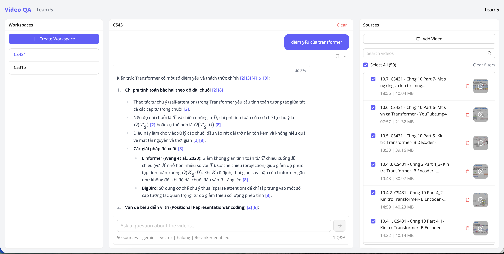

# Educational Video QA System

### Course Project – CS431: Deep Learning Techniques and Applications

### University of Information Technology – VNU-HCM (UIT)

### Lecturer: Dr. Nguyễn Vinh Tiệp

This project implements an intelligent question-answering system for educational videos using a Retrieval-Augmented Generation (RAG) pipeline. It enables users to upload video lectures, index their content, and ask natural-language questions which the system answers based on retrieved video segments.


## Team Members

| No. | Full Name         | Student ID | Role   |
| --- | ----------------- | ---------- | ------ |
| 1   | Pham Nguyen Tuong | 23521751   | Leader |
| 2   | Chuong Hong Van   | 23521769   | Member |
| 3   | Tang Hoang Phuc   | 23521219   | Member |


## Features

-   Upload and manage educational videos
-   Intelligent question answering based on video content
-   Workspace management and video organization
-   Semantic search using vector embeddings
-   BM25-based reranking
-   User authentication with JWT

## Tech Stack

### Backend

-   FastAPI
-   MongoDB (Motor)
-   LangChain + ChromaDB
-   Google Gemini
-   Sentence Transformers
-   PyTorch + OpenCV

### Frontend

-   React + TypeScript
-   Vite
-   Ant Design
-   TanStack Query
-   Axios

## System Requirements

-   Python 3.9+
-   Node.js 18+
-   MongoDB
-   FFmpeg

## Installation and Setup

### 1. Clone the repository

```bash
git clone <repository-url>
cd educational_video_qa
```

### 2. Backend Setup

```bash
cd backend

python -m venv venv
source venv/bin/activate     # macOS/Linux
# or: venv\Scripts\activate  # Windows

pip install -r requirements.txt

cp .env.example .env

fastapi run app/main.py
```

Backend URL:

```
http://localhost:8000
```

Documentation:

```
http://localhost:8000/docs
```

### 3. Frontend Setup

```bash
cd frontend

npm install
cp .env.example .env

npm run dev
```

Frontend URL:

```
http://localhost:5173
```

## Usage

1. Access the frontend interface
2. Register or log in
3. Create a workspace
4. Upload an educational video
5. Ask questions based on the video content

## Project Structure

```
educational_video_qa/
├── backend/
│   ├── app/
│   │   ├── api/
│   │   ├── models/
│   │   ├── schemas/
│   │   ├── services/
│   │   └── utils/
│   └── storage/
├── frontend/
│   └── src/
│       ├── components/
│       ├── pages/
│       ├── apiServices/
│       └── types/
└── README.md
```

## Environment Variables

### Backend `.env`

```
MONGODB_URL=mongodb://localhost:27017
MONGODB_DATABASE=educational_video_qa
SECRET_KEY=your-secret-key-change-this-in-production
ALGORITHM=HS256
ACCESS_TOKEN_EXPIRE_MINUTES=43200
UPLOAD_DIR=./storage/videos
CHROMA_PERSIST_DIR=./storage/chroma_db
GEMINI_API_KEYS=your-gemini-api-key,...
```

### Frontend `.env`

```
VITE_API_BASE_URL=http://localhost:8000
```

## Scripts

### Backend

```bash
fastapi run app/main.py
```

### Frontend

```bash
npm run dev
npm run build
npm run preview
```

## Contributing

This project is developed as part of
**CS431 – Deep Learning Techniques and Applications**
University of Information Technology – VNU-HCM.

## License

MIT License
